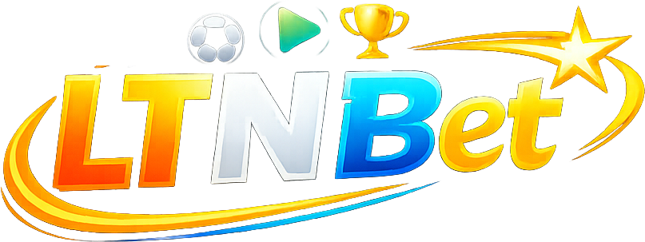

# 🏆 LTNBet — Jeu de Paris Sportifs en Direct

<p align="center">
  
</p>

<p align="center">
  <strong>L'expérience interactive de paris en direct conçue pour les bars et soirées de match !</strong>
</p>

<p align="center">
  
  
</p>

---

## 📖 Présentation du Projet

**LTNBet** (*Les Toiles Noires Bet*) est une application web moderne de paris en direct conçue spécifiquement pour animer la retransmission de matchs de football dans un bar ou espace événementiel. 

Le concept est simple et addictif :
1. **Rejoindre** : Les clients du bar scannent un QR code géant affiché sur un écran ou sur le comptoir, choisissent un pseudonyme et un avatar légendaire du ballon rond, et reçoivent une dotation de départ en **Toiles Coins (TC)**.
2. **Parier** : Pendant le match en direct, ils placent des pronostics sur une grande variété de marchés avec des **cotes dynamiques** qui s'ajustent en temps réel selon la répartition des mises.
3. **Suivre** : Un écran public ("Screen") affiche le leaderboard en temps réel, le match en cours avec ses statistiques en direct, et les alertes de but.
4. **Récompenses** : À tout moment, les joueurs peuvent échanger leurs jetons virtuels durement gagnés contre de vraies consommations (pinte, cocktail, burger) ou cadeaux directement au comptoir !

---

## 📺 Les Écrans du Jeu

L'application est structurée en plusieurs interfaces optimisées pour les joueurs et l'organisateur (l'hôte) :

### 1. 🏟️ Écran des Paris & Statistiques (`/`)
C'est le centre névralgique pour le joueur. Il présente :
* **Tableau d'affichage dynamique** : Score, temps écoulé et statut de la rencontre.
* **Statistiques détaillées en temps réel** : Possession de balle, tirs cadrés/non-cadrés, corners obtenus, cartons distribués et précision des passes pour chaque équipe.
* **Les Marchés de Paris** :
  * *Résultat Final (1N2)* : Victoire à domicile, Nul ou Victoire à l'extérieur.
  * *Score Exact* : Grille de scores possibles (les scores rendus impossibles par l'évolution du match sont automatiquement suspendus en temps réel).
  * *Premier Buteur* : Liste des 15 joueurs vedettes de la rencontre avec leurs cotes ajustées.
  * *Corners & Marchés Flash* : 9 nouveaux marchés rapides Yes/No (Double Chance, Plus de 1.5/3.5 buts, Clean Sheets, etc.) pour dynamiser les prises de risques.

### 2. ⏳ Mes Paris - Historique Bento (`/history`)
*Un tout nouvel écran accessible directement depuis le menu principal pour suivre ses pronostics.*
* **Statistiques Bento** : Total de paris placés, nombre de paris gagnés et pronostics actuellement en attente.
* **Liste de suivi colorée** :
  * 🟢 **Vert** : Pari Gagné avec mention des gains de Toiles Coins (TC).
  * 🔴 **Rouge** : Pari Perdu avec le montant de la mise déduit.
  * 🟣 **Violet** : Pari En Attente avec indicateur de sablier.
* Affiche pour chaque pari l'intitulé exact du marché, le pronostic choisi et la cote au moment de la validation.

### 3. 📊 Classement en Direct (`/ranking`)
* **Compétition en temps réel** : Classement complet des joueurs physiques présents dans le bar.
* **Simulation active** : Intégration de 10 bots parieurs automatiques (ToileMaster, AlexPro99, ShadowBet...) pour animer le leaderboard et encourager la compétition.
* Visualisation des gains cumulés et des badges de prestige de chaque participant.

### 4. 👤 Profil, Badges & Invitation (`/profile`)
* **Identité visuelle** : Affichage de l'avatar footballistique choisi et du rang actuel dans la compétition.
* **Statistiques clés** : Gains cumulés totaux, taux de réussite (%), et meilleur gain historique.
* **Système de Badges de Réussite** :
  * 🏆 *Nostradamus* : 5 bons paris consécutifs.
  * 👁️ *Oracle Bleu* : 10 bons paris au total.
  * 🎖️ *Roi des Buteurs* : 5 premiers buteurs trouvés.
  * 💎 *Visionnaire* : Avoir trouvé au moins un score exact.
  * 👑 *Légende des Toiles* : Atteindre la 1ère place du classement.
* **QR Code & Partage** : QR Code dynamique généré localement pour permettre à un ami de scanner et de rejoindre instantanément le salon de jeu.

### 5. 🎛️ Console d'Administration Hôte (`/admin`)
Réservée à l'organisateur de l'événement (sécurisée par clé secrète) :
* **Sélection d'événements** : Importation directe de matchs réels et de leurs cotes depuis *Odds API*.
* **Contrôleur de match en direct** : Simulation et modification manuelle du score, du temps, et des statistiques.
* **Gestionnaire d'événements** : Déclenchement d'alertes spéciales (BUT !, Carton Rouge 🟥, Corner) envoyées en temps réel via Server-Sent Events (SSE) sur les écrans de tous les joueurs connectés.
* **Résolution & Payouts** : Résolution automatique et intelligente des marchés complexes et des paris des joueurs dès la fin de la rencontre, distribuant instantanément les Toiles Coins.
* **Registre de Récompenses** : Suivi et validation des réclamations de pintes/burgers faites par les clients.

---

## 🛠️ Guide d'Installation

### Prérequis
* [Node.js](https://nodejs.org/) (Version 18 ou 20 de préférence)
* `npm` (installé avec Node.js)

### Étape 1 : Cloner le dépôt et installer les dépendances
```bash
git clone https://github.com/votre-compte/ParisCdmLTN.git
cd ParisCdmLTN
npm install
```

### Étape 2 : Configurer les Variables d'Environnement
Créez un fichier `.env.local` à la racine du projet en vous basant sur la configuration suivante :

```ini
# --- API KEYS ---
# Clé pour récupérer les cotes réelles (odds-api.com ou odds-api.io)
ODDS_API_IO_KEY=votre_cle_odds_api

# Clé API-Football pour les statistiques live et l'enrichissement des données
FOOTBALL_API_KEY=votre_cle_api_football

# Clé Football-Data.org pour les statuts et scores de secours
FOOTBALL_DATA_ORG_KEY=votre_cle_football_data

# --- PREFERENCES DE COTES ---
# Bookmaker principal utilisé pour extraire les cotes
ODDS_BOOKMAKER="Winamax FR"
# Bookmaker de secours pour fusionner les marchés indisponibles sur le premier
ODDS_BOOKMAKER_FALLBACK="Betclic FR"

# --- SECURITE ---
# Mot de passe administrateur pour l'accès aux commandes /admin
ADMIN_API_SECRET=mot_de_passe_secret
```

### Étape 3 : Lancer le serveur local
Pour lancer le serveur de développement avec rechargement automatique :
```bash
npm run dev
```
Ouvrez [http://localhost:3000](http://localhost:3000) dans votre navigateur pour accéder au portail joueur.
La console d'administration est disponible sur `/admin`.

---

## 🐳 Déploiement en Production (Docker)

Le projet intègre un fichier `Dockerfile` et un fichier `docker-compose.yml` préconfigurés pour un déploiement robuste en un clic sur un serveur VPS.

La base de données SQLite `ltn.db` est automatiquement stockée dans un volume persistant afin de conserver l'historique des parties et des comptes joueurs en cas de redémarrage.

```bash
# Lancer le projet en arrière-plan
docker-compose up --build -d

# Arrêter les conteneurs
docker-compose down
```

---

## 🎮 Règles et Mécaniques de Jeu

### 1. Le Solde de Départ et les Gains
Chaque joueur débute la partie avec un solde virtuel de **1000 Toiles Coins (TC)**.
Les mises minimales et maximales sont configurables, mais par défaut, les joueurs peuvent miser la somme qu'ils souhaitent.

### 2. Algorithme des Cotes Dynamiques
Afin d'éviter que le bar ne fasse "faillite virtuelle" et pour encourager les prises de risques amusantes, les cotes de chaque pari s'adaptent de façon **dynamique** :
* Plus un résultat est plébiscité (mises élevées sur cet outcome), plus sa cote diminue en temps réel.
* Inversement, les cotes des choix boudés par le public augmentent, offrant de formidables opportunités de remontées dans le classement.

### 3. Réclamation des Récompenses
Dans l'onglet Boutique (ou profil), les joueurs peuvent échanger leurs pièces virtuelles accumulées contre de véritables cadeaux physiques à réclamer au comptoir :
* **Pinte de bière offerte** : 2 500 TC 🍺
* **Cocktail Création du barman** : 3 500 TC 🍹
* **Burger Toiles Noires** : 5 000 TC 🍔
* **Casquette collector Toiles Noires** : 4 000 TC 🧢

*L'hôte valide la réclamation sur son écran d'administration d'un simple clic pour déduire définitivement les jetons.*

---

## 🤝 Contribution
Toute contribution est la bienvenue ! N'hésitez pas à ouvrir des issues ou à soumettre des Pull Requests pour de nouvelles fonctionnalités ou des améliorations graphiques.

*Développé avec ❤️ pour animer vos meilleures soirées football.*
